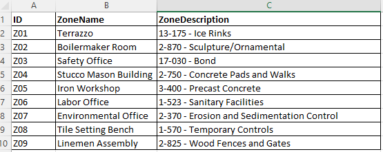
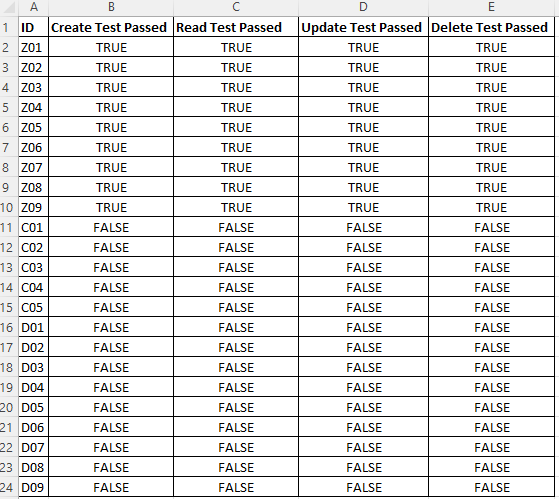
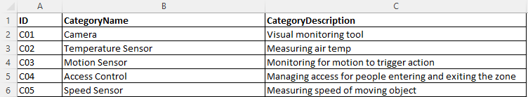
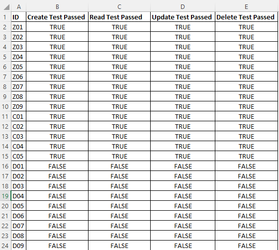
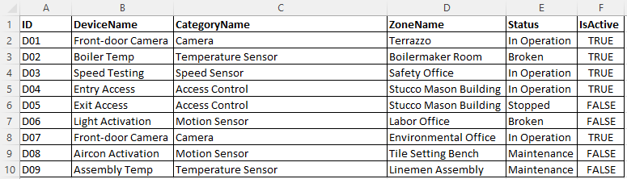

# CMPG 323 Project 4 : Testing and Robotic Process Automation (RPA) with UiPath

### Table of Contents
1. [Introduction](#intro) 
2. [Testing the IoT Zones](#zones)
3. [Testing the IoT Categories](#categories)
4. [Testing the IoT Devices](#devices)
5. [Contributors](#cont)
6. [References](#refs)

## 1. Introduction
This is the fourth project of the CMPG 323 module deliverables. Testing is a crucial part of any solution and can be done from many different perspectives; the internal development team testing, business user acceptance testing (UAT), etc.

Robotic Process Automation (RPA) refers to the use of technology to mimic human tasks in the same way that a person would execute a process. This usually refers to, what we would call, ‘front-end’ or UI (User Interface) automation. RPA is often used to automate time-consuming and highly repetitive tasks to allow people the availed capacity to work on more intuitive tasks.

Therefore this project aims to use the power of RPA with UiPath to test the functionality of the IoT Device Management System hosted at https://connectedoffice-devicemanagement.azurewebsites.net/.

### Testing Scope
Therefore, for the complete and satisfactory operations of the IoT Device Management System, the following information is stored in the database about each entity:
* System User
    * Username (Email Address)
    * Password 

* Category  
    * Category ID
    * Category Name
    * Category Description    

* Zone   
    * Zone ID
    * Zone Name
    * Zone Description   

* Device
    * Device ID
    * Device Name
    * Category ID
    * Zone ID
    * Status
    * Is Active   

### 1.2 Entity Rules and Restrictions
The above entity information is stored in a relational database. The database tables do not have a complete set of constraints that could prevent or limit, for example the deletion of mandatory information.
Therefore most of the data integrity rules are enforced with the application (WebAPI), and the following are some of the applicable rules:

    * On creation or update, the zone id is checked if valid
    * On creation or update, the category id is checked if valid

## 2. Testing the IoT Zones
The test data to be used for Zones is contained in same excel file under sheet 'Zones'. As indicated in the image below, the data consists three (3) distinct columns: 
* Zone ID
* Zone Name
* Zone Description.

<em>The image above shows the zones subset of test data from the provided Excel file</em>

For performance reasons, at the beginning of the test process for zones, the whole test data is read from the excel file into the ZoneDtatable. Before the test zones data in the datatable is processed, the automation process first iteratively deletes all exiting zones in the web application. After the previous test data is removed, then for each row of test data, the following automation process is followed:
* CREATE
    * A zone is created by entering the name and description in the fields provided
    * If the creation is successful, then the 'Create Test Passed' for that Zone ID is updated to 'TRUE', otherwise 'FALSE'
* READ
    * After the zone is created, the details are read and displayed on the zone details page
    * If the read is successful, then the 'Read Test Passed' for that Zone ID is updated to 'TRUE', otherwise 'FALSE'
* UPDATE
    * The created zone is edited by appending the text 'EDITED' at the end of the name and description
    * If the update is successful, then the 'Update Test Passed' for that Zone ID is updated to 'TRUE', otherwise 'FALSE'
* DELETE
    * The created zone is then finally deleted by auto-clicking the delete icon for that row on the zones home page
    * If the deletion is successful, then the 'Delete Test Passed' for that Zone ID is updated to 'TRUE', otherwise 'FALSE'

All the above updates of the test results are stored in the TestResults datatable. After all the test data has been processed, the 'Test Results' sheet of the excel file is updated with the test results datatable as indicated below, assuming that all tests passed.

<em>The image above shows the test results sheet after all zones has been processed successfully and the Excel file updated accordingly</em>

## 3. Testing the IoT Categories
The test data to be used for Categories is contained in same excel file under sheet 'Category'. As indicated in the image below, the data consists three (3) distinct columns: 
* Category ID
* Category Name
* Category Description.

<em>The image above shows the categories subset of test data from the provided Excel file</em>

For performance reasons, at the beginning of the test process for categories, the whole test data is read from the excel file into a CategoryDtatable. Before the test categories data in the datatable is processed, the automation process first iteratively deletes all exiting categories in the web application. After the previous test data is removed, then for each row of test data, the following automation process is followed:
* CREATE
    * A category is created by entering the name and description in the fields provided
    * If the creation is successful, then the 'Create Test Passed' for that Category ID is updated to 'TRUE', otherwise 'FALSE'
* READ
    * After the category is created, the details are read and displayed on the zone details page
    * If the read is successful, then the 'Read Test Passed' for that Category ID is updated to 'TRUE', otherwise 'FALSE'
* UPDATE
    * The created category is edited by appending the text 'EDITED' at the end of the name and description
    * If the update is successful, then the 'Update Test Passed' for that Category ID is updated to 'TRUE', otherwise 'FALSE'
* DELETE
    * The created category is then finally deleted by auto-clicking the delete icon for that row on the zones home page
    * If the deletion is successful, then the 'Delete Test Passed' for that Category ID is updated to 'TRUE', otherwise 'FALSE'

All the above updates of the test results are stored in the TestResults datatable. After all the test data has been processed, the 'Test Results' sheet of the excel file is updated with the test results datatable as indicated below, assuming that all tests passed.

<em>The image above shows the test results sheet after all categories has been processed successfully and the Excel file updated accordingly</em>

## 4. Testing the IoT Devices
The test data to be used for Devices is contained in same excel file under sheet 'Device'. As indicated in the image below, the data consists three (3) distinct columns: 
* Device ID
* Device Name
* Category Name
* Zone Name
* Status
* Is Active

<em>The image above shows the devices subset of test data from the provided Excel file</em>

For performance reasons, at the beginning of the test process for devices, the whole test data is read from the excel file into a DeviceDtatable. Before the test devices data in the datatable is processed, the automation process first iteratively deletes all exiting devices in the web application. After the previous test data is removed, then for each row of test data, the following automation process is followed:
* CREATE
    * A device is created by entering the name and description in the fields provided
    * If the creation is successful, then the 'Create Test Passed' for that Device ID is updated to 'TRUE', otherwise 'FALSE'
* READ
    * After the device is created, the details are read and displayed on the zone details page
    * If the read is successful, then the 'Read Test Passed' for that Device ID is updated to 'TRUE', otherwise 'FALSE'
* UPDATE
    * The created device is edited by appending the text 'EDITED' at the end of the name and status, selecting a random category and zone, toggling is the is active field
    * If the update is successful, then the 'Update Test Passed' for that Device ID is updated to 'TRUE', otherwise 'FALSE'
* DELETE
    * The created device is then finally deleted by auto-clicking the delete icon for that row on the zones home page
    * If the deletion is successful, then the 'Delete Test Passed' for that Device ID is updated to 'TRUE', otherwise 'FALSE'

All the above updates of the test results are stored in the TestResults datatable. After all the test data has been processed, the 'Test Results' sheet of the excel file is updated with the test results datatable as indicated below, assuming that all tests passed.

<em>The image above shows the test results sheet after all categories has been processed successfully and the Excel file updated accordingly</em>

## 5. Contributors
* [Chipo Hamayobe (37016776)](https://github.com/ChiefMonk) - Project Lead

## 6. References
### Software Testing
* [Testing in .NET](https://learn.microsoft.com/en-us/dotnet/core/testing/)
* [Test Driven Development](https://deviq.com/practices/test-driven-development)
* [Unit testing best practices with .NET Core and .NET Standard](https://learn.microsoft.com/en-us/dotnet/core/testing/unit-testing-best-practices)
* [Unit testing C# in .NET Core using dotnet test and xUnit](https://learn.microsoft.com/en-us/dotnet/core/testing/unit-testing-with-dotnet-test)
* [What is User Acceptance Testing (UAT)? Examples](https://www.guru99.com/user-acceptance-testing.html)
* [What Is User Acceptance Testing (UAT): A Complete Guide](https://www.softwaretestinghelp.com/what-is-user-acceptance-testing-uat/)
* [User Acceptance Testing and the Application Lifecycle](https://www.red-gate.com/simple-talk/development/dotnet-development/user-acceptance-testing-application-lifecycle/)
* [What is Automation Testing? Test Tutorial](https://www.guru99.com/automation-testing.html)
* [Automated software testing](https://www.atlassian.com/continuous-delivery/software-testing/automated-testing)
* [Connected Office: Device Management](https://connectedoffice-devicemanagement.azurewebsites.net/)
* [CMPG-323-IOT-Device-Management](https://github.com/JacquiM/CMPG-323-IOT-Device-Management)

### Robotic Process Automation (RPA) with UiPath
* [UiPath Website](https://www.uipath.com)
* [Robotic Process Automation (RPA)](https://www.uipath.com/rpa/robotic-process-automation)
* [Introduction to RPA and Automation (Course)](https://academy.uipath.com/courses/introduction-to-rpa-and-automation)
* [UI Automation with UiPath](https://docs.uipath.com/studio/docs/ui-automation)
* [Excel Automation with UiPath Studio](https://www.uipath.com/learning/video-tutorials/excel-datatables-automation)
* [UiPath Automation Cloud Account](https://platform.uipath.com)
* [Introduction to UiPath Portal, Orchestrator & Studio](https://www.youtube.com/watch?v=BAYmmUuB2Zo)
* [How to Calculate and Update Data within an Excel Workbook in UiPath](https://www.youtube.com/watch?v=-w8rorapLS8)
* [UIPath read excel and enter the data into web forms](https://www.youtube.com/watch?v=lw6bxrMNzfM)
* [How to Automate a Website Login with UiPath Studio](https://www.youtube.com/watch?v=030dEAB8oyg)
* [UiPath - Use Application/Browser Activity| Modern Activity in UiPath | Open Browser & Application](https://www.youtube.com/watch?v=s1InnQCymPA)
* [UiPath Community Forums: Find A Chapter](https://community.uipath.com/chapters/)
* [How to Open Browser and Login with UiPath - Full Tutorial](https://www.youtube.com/watch?v=wk2PBLU3mg0)
* [UiPath RPA Beginners Tutorial - 2020](https://www.youtube.com/watch?v=3ZKzTHdpsTs)
* [How to get the entire row based on the cell value in UiPath](https://forum.uipath.com/t/how-to-get-the-entire-row-based-on-the-cell-value-in-uipath/193445/3)
* [UiPath Studio: Your First Process Automation](https://www.youtube.com/watch?app=desktop&v=OyQAhrcBr9U)

